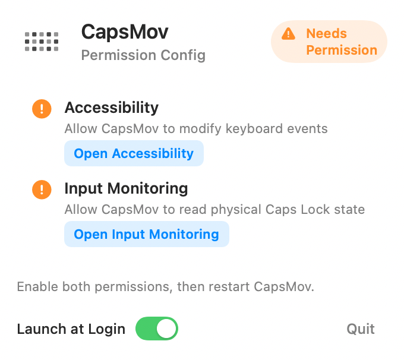
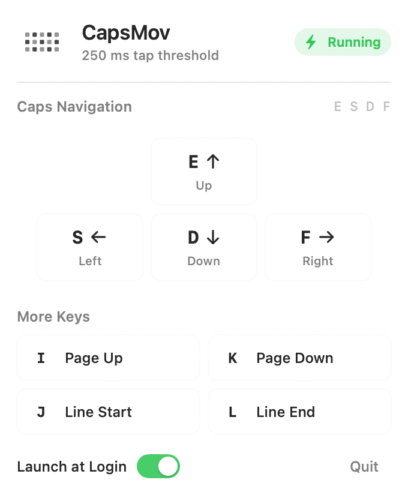

# CapsMov Basic Navigation

CapsMov is a lightweight native macOS menu-bar tool that turns `Caps Lock` into
a temporary navigation layer.

| Hotkey | Output |
| --- | --- |
| `Caps Lock + E` | Up |
| `Caps Lock + D` | Down |
| `Caps Lock + S` | Left |
| `Caps Lock + F` | Right |
| `Caps Lock + I` | Page Up |
| `Caps Lock + K` | Page Down |
| `Caps Lock + J` | Line Start (`Command + Left`) |
| `Caps Lock + L` | Line End (`Command + Right`) |

Quickly tapping `Caps Lock` alone keeps the original macOS Caps Lock toggle.
Holding `Caps Lock`, or pressing any other key while it is held, treats Caps as
the temporary navigation-layer modifier instead.

## Native Implementation

The current implementation does not depend on Karabiner-Elements. It is a small
Swift executable built around a macOS HID event tap plus IOHID physical key
state:

- `CapsloxCore` contains the tested remapping state machine.
- `capslox` monitors the physical Caps Lock key with IOHID, so the navigation
  layer is active only while Caps Lock is actually held down.
- CapsMov distinguishes a short standalone Caps tap from a modifier hold using a
  tap threshold. The default threshold is `250ms`.
- CapsMov clears the system Caps Lock state whenever Caps is used as the
  navigation layer, including after a long press, so releasing Caps Lock leaves
  normal typing unchanged.
- A HID-level `CGEventTap` suppresses consumed source events and posts the
  mapped navigation events before the system toggles Caps Lock.
- Generated events are tagged and ignored by the tap to avoid recursion.

This keeps the open-source surface small: Swift Package Manager, Swift Testing,
and macOS system frameworks only.

## Menu Bar UI

The packaged app appears in the macOS menu bar as `CapsMov`. It stays out of the
Dock and exposes a compact status popover:

- Running, paused, or permission-needed state
- An enabled switch for the Caps navigation layer
- The current tap threshold
- A compact shortcut map for `Caps + E/D/S/F/I/K/J/L`
- A first-run Permission Config screen for Accessibility and Input Monitoring
- A Launch at Login switch
- Quit

### Screenshots

Permission setup:



Main popover:



## Bluetooth Keyboard Support

Bluetooth keyboards are supported generically. CapsMov handles every keyboard
event macOS delivers to the HID event tap, regardless of transport, vendor,
product ID, or keyboard model.

That means there are no per-keyboard rules for Bluetooth devices. If macOS sees
the device as a keyboard and emits normal key events, CapsMov applies the same
Caps Lock layer to it.

Known limits:

- Secure Input fields and some system security contexts can block event taps.
- The login window is out of scope for this lightweight user-session tool.
- Devices that do not emit normal macOS keyboard events cannot be remapped by
  this user-space implementation.

## Build And Run

Build and test:

```sh
swift test
swift build
```

Run from the repo:

```sh
swift run capslox
```

For a release binary:

```sh
swift build -c release
.build/release/capslox
```

To tune the short-tap threshold:

```sh
CAPSLOX_TAP_THRESHOLD_MS=300 .build/release/capslox
```

## Package As An App Or DMG

Build a background macOS app bundle:

```sh
scripts/build-app.sh
```

The app is written to:

```text
dist/CapsMov.app
```

The app icon is generated from `assets/CapsloxIcon.png`, converted to
`assets/CapsloxIcon.icns`, and bundled into `CapsMov.app` automatically.

Build a DMG:

```sh
scripts/build-dmg.sh
```

The DMG is written to:

```text
dist/CapsMov.dmg
```

The app is ad-hoc signed for local use. Public distribution outside your own
machines should add Developer ID signing and notarization.

## Autostart

The DMG includes:

```text
Install Autostart.command
Uninstall Autostart.command
```

`Install Autostart.command` copies `CapsMov.app` to:

```text
~/Applications/CapsMov.app
```

Then it installs and starts this user LaunchAgent:

```text
~/Library/LaunchAgents/com.capsmov.app.plist
```

To install autostart with a custom tap threshold, run the installer command from
Terminal with an environment variable:

```sh
CAPSLOX_TAP_THRESHOLD_MS=300 "/Volumes/CapsMov/Install Autostart.command"
```

`Uninstall Autostart.command` removes the LaunchAgent. It leaves
`~/Applications/CapsMov.app` in place so you can still run or delete the app
manually.

The LaunchAgent starts CapsMov at login but does not force-restart it after you
choose `Quit` from the menu-bar popover.

On first run, macOS needs permission to let CapsMov modify keyboard events.
Enable the terminal or app that launches CapsMov in:

```text
System Settings > Privacy & Security > Accessibility
```

CapsMov also reads physical keyboard state through IOHID. Enable the same
launcher in:

```text
System Settings > Privacy & Security > Input Monitoring
```

## Behavior Notes

`Caps Lock + J/L` uses macOS line navigation:

```text
Command + Left
Command + Right
```

This is more consistent across macOS text fields than raw `Home` / `End`, which
some apps interpret as document start/end.

When `Caps Lock` is held with any non-mapped key, that key is passed through,
but the gesture no longer toggles Caps Lock on release. Only a standalone tap
within the threshold toggles the system Caps Lock state.

## Legacy Karabiner Path

`install-macos-karabiner.sh` and the shell tests are kept as legacy material for
the earlier Karabiner-based experiment. They are not required by the native
implementation.
